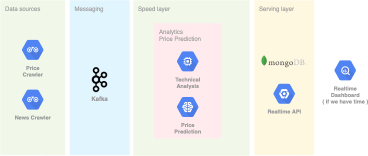

# GABI - Forex

This repository contains code and documentation for our project in DAD course WS2021

## Table of contents
- [Architecture](#architecture)
    + [Overview](#overview)
    + [The pipeline](#the-pipeline)
      - [Price Crawler](#price-crawler)
      - [News Crawler](#news-crawler)
      - [Kafka](#kafka)
      - [Technical Analysis and Price Prediction](#technical-analysis-and-price-prediction)
      - [Realtime API](#realtime-api)
      - [Realtime Dashboard](#realtime-dashboard)
- [Preparation](#preparation)
  * [Price crawler](#price-crawler)
  * [News crawler](#news-crawler)
- [Deployment](#deployment)
    + [1. Services](#1-services)
    + [2. Frontend](#2-frontend)
    + [3. Spark](#3-spark)
## Architecture
#### Overview


#### The pipeline
##### Price Crawler
The price data such as tick data and candle data are collected by the `Price Crawler`.
Those realtime data are sent to Kafka.
##### News Crawler
There are 2 implemented news crawlers: DailyFX (dailyfx.com) and Reuters (reuters.com).
The news crawler collect the latest news and sent them to Kafka.   
##### Kafka
The topics are named in the following format: `{project}.{subject}.{version}`. For example: `dad.candle.0`  
With this naming strategy, 
we can adapt structural changes and migrate with less effort by incrementing the version and support multiple versions at the same time.
##### Technical Analysis and Price Prediction
The spark jobs calculate the technical indicators such as Relative Strength Index (RSI), Bollinger Bands, etc. and try to predict the close price of the next candle.
The predictions will be sent back to Kafka again.
##### Realtime API
This component offers the API for the frontend to access the data in MongoDB and to receive updates in realtime. 

##### Realtime Dashboard
This is the frontend, where you can interact with the system and see it in action. The data are updated in realtime 
## Preparation
### Price crawler
1. You need a FXCM Demo account. You can apply for a demo account here: https://www.fxcm.com/uk/forex-trading-demo/
2. Generate a persistent token. Go to https://tradingstation.fxcm.com, login, then click on `User Account > Token Management`.
3. Set your token as environment variable `FXCM_TOKEN` in `deployment/docker-compose.yml`

### News crawler
In the current `deployment/docker-compose.yml` there is only one active news crawler, namely the DailyFX crawler. You can also 
start the Reuters crawler by using the `reuters.py` file.

## Deployment
#### 1. Services
To spin up all services, run the following commands:
```bash
cd deployment
docker-compose up
```
#### 2. Frontend
If you already have a build of the frontend, you can serve it however you like (e.g. using a nginx container).  
Otherwise, you can run the following commands to bring the frontend up in development environment:
```bash
cd services/realtime-ui
npm start
```

#### 3. Spark
In order to run the spark job for analytics and price prediction, you need to submit them.
Here is an example of submitting a spark job for price prediction with period "m1".
Note that the `--network` parameter may be differ.
```bash
cd services/sparkjobs

docker run -v $(pwd):/app \
--network=deployment_gabi \
deployment_sparkmaster /spark/bin/spark-submit \
 --packages org.apache.spark:spark-sql-kafka-0-10_2.12:3.0.1 \
 --conf spark.executorEnv.frameName=m1 \
 --files /app/models/EURUSD_m1.h5,/app/models/scaler_EURUSD_m1.pkl /app/price.py
```

